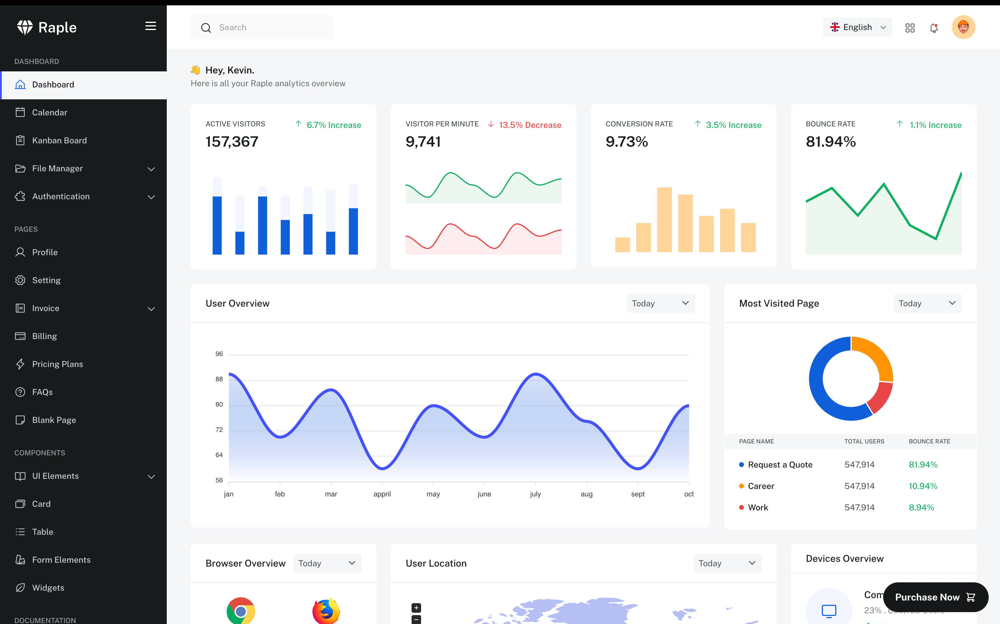

# [Templatecookie](https://templatecookie.com)
Templatecookie.com creates quality templates and php scripts. Templatecookie has many free HTML & Figma templates available for professional use. Templatecookie is famouse for their premium PHP Scripts available on [Codeanyon Marketplace](https://codecanyon.net/user/templatecookie). Browse [Templatecookie](https://templatecookie.com) today and discover awesome digital products.

# [Raple HTML Admin Dashboard Template](https://templatecookie.com/demo/raple-admin-dashboard-bootstrap-template)

> Raple is an admin dashboard template built with the Bootstrap framework. Raple is a featured-packed HTML template.

Check the [Live Demo here](https://raple-dashboard.netlify.app).

## Feature
- Kanban Board
- Calendar
- Themeing and Layout
- Invoice
- Map

## Framework & Technologies
- [Bootstrap](https://getbootstrap.com/)
- [scss](https://sass-lang.com/)
- [jQuery](https://jquery.com/)
- [chart](https://www.chartjs.org/docs/latest/developers/plugins.html)
- [google fonts](https://fonts.google.com/)

## Credits
- Design & Developed by [Templatecookie](https://templatecookie.com)

## License
The MIT License (MIT). Please see [License File](LICENSE.md) for more information.
